Microsoft ToDo Workflow for Alfred (Beta)
==========================
Work-in-progress [Alfred](http://www.alfredapp.com/) workflow for [Microsoft ToDo](http://todo.microsoft.com) (requires Alfred 2 or 3 with a Powerpack license).

Beginner and advanced approaches to adding a monthly repeating task beginning the following week:

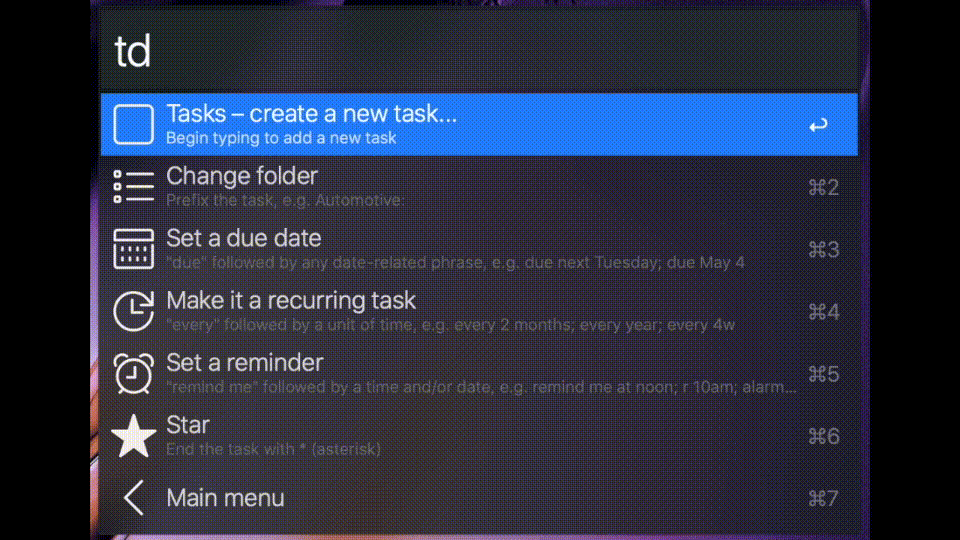

----------

| Jump to: | [Setup](#setup) | [Add Tasks](#add-tasks) | [Search and Browse Tasks](#search-and-browse-tasks) | [Editing Tasks](#editing-tasks) | [Hints](#hints) |
| :------: | :-------------: | :---------------------: | :-------------------------------------------------: | :-----------------------------: | :-------------: |

Setup
-----

### [Download here](https://raw.github.com/johandebeurs/alfred-mstodo-workflow/master/mstodo.alfredworkflow)

After downloading, simply double-click to install the workflow in Alfred. Use the `td` command in Alfred to activate the workflow, or assign a hotkey in Alfred preferences. The workflow will guide you through securely logging in to Microsoft ToDo and will even let you know when an important update is available.

Add tasks
--------

The workflow provides an easy guided experience with tips along the way that will help you become a power user.

The welcome screen appears when you've typed `td` (and nothing else). Special commands are in the form `td-command` with no space; once you type a space after `td ` you're in task entry mode. Partial commands are matched, so rather than typing `td-upcoming` to get to the Upcoming tasks list you can type as little as `td-up` or even `tdu`.

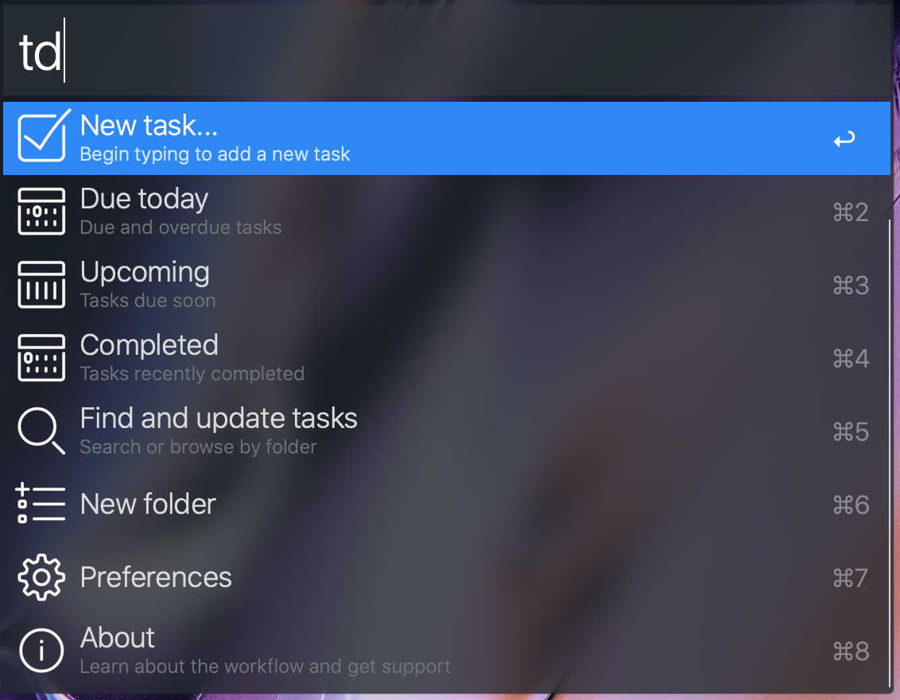

### Adding tasks with due dates and recurrence

Add your first task! As you type, the workflow will pick out due dates and recurrence intervals in just about any format you could think of. Just write naturally, the due date, recurrence, and task text are updated in Alfred as you type.

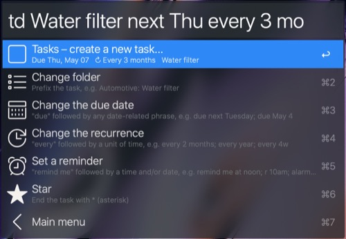

Use the menus to configure your task until you become a power user capable of typing everything manually. It's so worthwhile to be able to drop tasks into Microsoft ToDo in under a second.

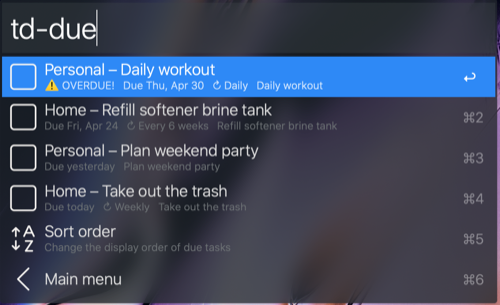

### Adding tasks to a specific list

To select a list, type it first followed by a colon or use the Change list menu item. No need to type the full list name, as long as you see the correct list in Alfred a few letters is usually sufficient. You can also set a [default list](#default-list) or default to the most recently used list.

You can also select a list *after* typing your task with the "in" keyword. To avoid false positives you will need to use all-caps in order to match a list by typing fewer than 3 characters.

#### Examples

> <strong>td h:Fix the broken step saturday morning*</strong>
>
> 
>
> **td Buy clicky keyboard in shopping due sat**
>
> 

> **td Rearrange file cabinet tomorrow in WO**
>
> 

### Reminders

Microsoft ToDo uses alerts to remind you about tasks that are due, either on the due date or in advance. To set a reminder, either include a time with your due date or use an explicit reminder phrase like *remind me at 3:00pm on June 11*).

#### Examples

> **td Pay DoubleCash credit card bill monthly June 26th remind me June 22**
>
> 
>
> **td Make a New Year's resolution reminder: Jan 1 at midnight**
>
> 
>
> **td weekly meeting notes r 8am due 1d**
>
> 
>
> **td Ask about app icon at dinner tomorrow**
>
> 

#### When is the reminder?

You can set a custom default reminder time from the workflow preferences screen, otherwise when a time is not specified the reminder will be set for 9am.

|  Reminder phrase includes |           Task without due date            |               Task with due date               |
| ------------------------- | ------------------------------------------ | ---------------------------------------------- |
| **Time only**             | Reminder today at the specified time       | Reminder on the due date at the specified time |
| **Neither time nor date** | Today, 1 hour from the current time*       | Default time (9am) on the due date**            |
| **Date and time**         | Exact date and time entered                | Exact date and time entered                    |
| **Date only**             | Default time (9am) on the specified date** | Default time (9am) on the specified date**     |

\* By default, reminders for the current day will be set to 1 hour from the current time. You can change this offset in the workflow preferences.

\*\* The default time can be changed in the workflow preferences. If the specified date is today, your reminder date offset preference will be used instead.

Search and browse tasks
-----------------------

The `td-search` command allows you to search tasks by keyword or browse by list. To seach within a list, use the same *td-search My List: some query* syntax as when entering a task.

#### Default search view
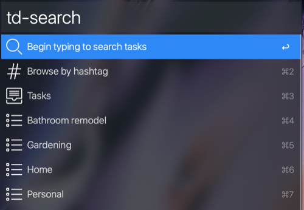

#### View a list
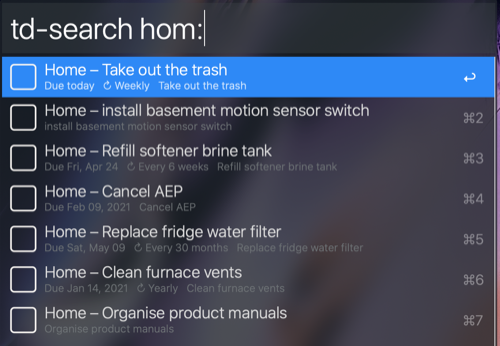

#### Search within a list
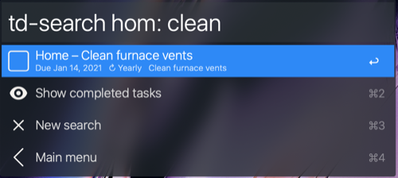

#### Search across all lists

Your search will match against tasks as well as list names.

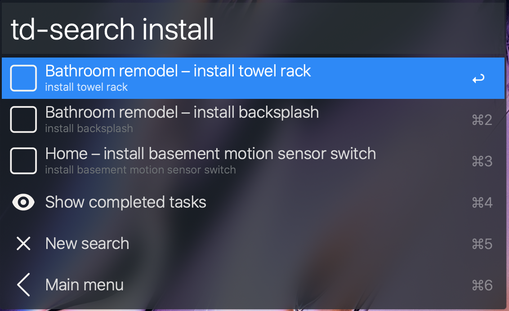

#### Browse tasks by hashtag

Type the hash symbol # to view and select a tag.

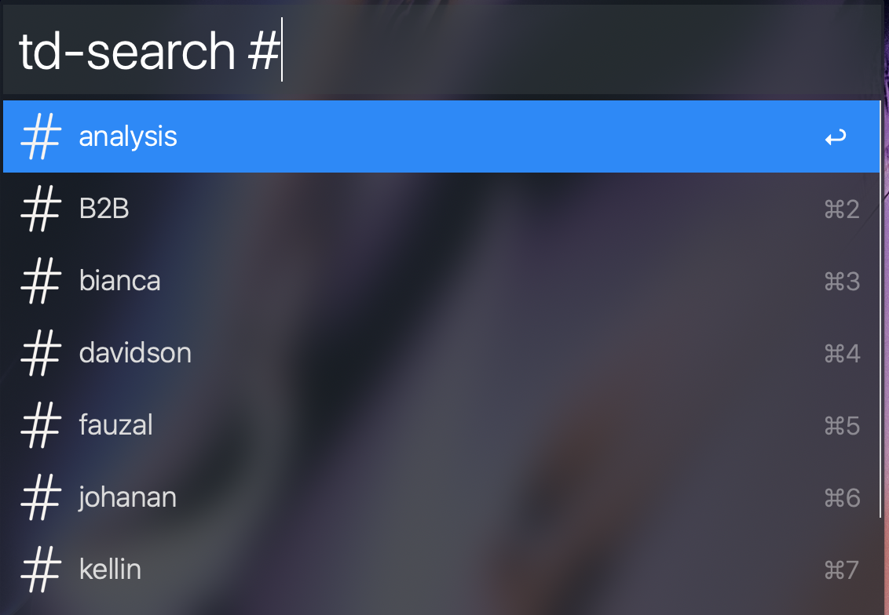

### Upcoming tasks

View upcoming tasks at `td-upcoming`. It's one half of the Planned list in Microsoft ToDo with the option to choose the duration that you prefer to look ahead (1 week, 2 weeks, 1 month, 3 days, whatever...). Like any other screen you can get there by typing as little as the first letter of the command: `tdu`:

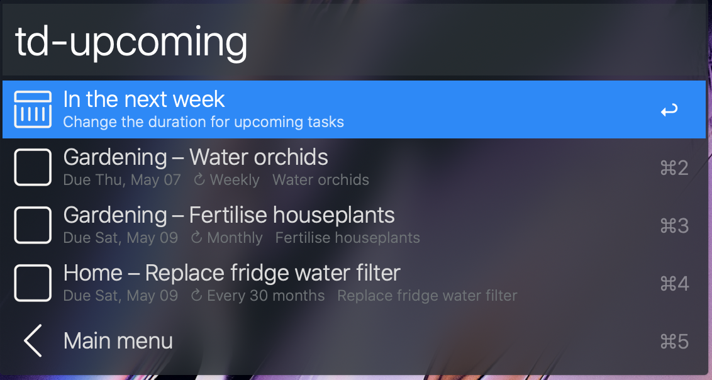

Browse or type to search your upcoming tasks. This screen can show upcoming tasks for any number of days with a few sensible defaults. Maybe there is someone out there who needs to see exactly 11 days ahead.

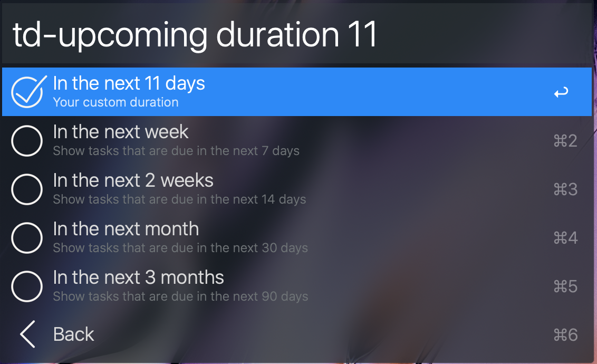

### Due and overdue tasks

The `td-due` command shows tasks that are due or overdue, similar the other half of the Planned list in Microsoft ToDo. By default it hoists any recurring tasks that are *multiple times overdue* to the top, but you can change the sort order. Sadly, I have quite a few tasks that are multiple times overdue, so this feature is mostly to keep me motivated but I hope others find it useful as well.

This view is searchable, just type to filter the results by keyword.

### In sync

The workflow stays in sync with Microsoft ToDo, so your lists and tasks will be up-to-date and searchable. The due and upcoming screens will sync (or wait for the already-running sync) *before showing results* to make sure that everything is up-to-date. A notification is displayed if there is something to sync so that you're not waiting around too long without any feedback.

Editing tasks
-------------

Tasks can be completed or deleted directly from the workflow. Simply find a task through the search, due, or overdue screens. Task editing is currently limited to completing and deleting tasks.

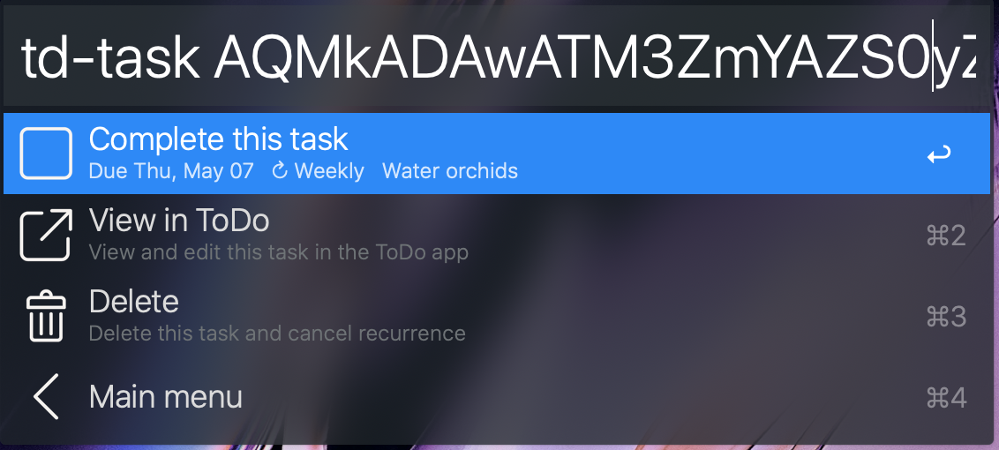

Overdue recurring tasks can be set due today to adjust the next occurrence by holding the <kbd>alt</kbd> key while marking a task complete. For example, if you are supposed to water the plants every 3 days but forget and do it 2 days late, you don't need to water them again the following day.

### View in Microsoft ToDo

Any task can be opened in the Microsoft ToDo desktop app for further editing. This is a quick way to view notes, subtasks, assignees, and other features that are not yet supported in the workflow. Microsoft doesn't seem to support linking directly to a task so the closest I have found is to trigger a search on task title, which is good enough for an MVP.

You can also open a new task in Microsoft ToDo by holding down the <kbd>alt</kbd> key when creating the task.

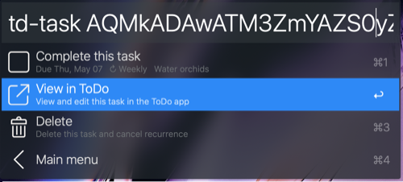

Hints
-----

Read the text below each menu option and you'll be on your way to power user status – most menu items include helpful tips about how to apply a setting without navigating the menu.

### Command shorthand

Commands like `td:list` and `td:pref` have been changed to `td-list` and `td-pref` to allow <kbd>alt</kbd>+<kbd>delete</kbd> to return you to the welcome screen (any non-word character is fine, I just chose `-` for its word breaking properties). Furthermore, these commands can be triggered with as little as the first letter. `tdd` will get you to the `td-due` screen and `tds` will get you to `td-search`. For this reason, you may noticed that top-level commands are first-letter-distinct to avoid conflicts.

### Default list

There is an option in `td-pref` to set a list other than Tasks as the default when entering tasks. This will save keystrokes when entering a large number of tasks into a list or when a custom list is preferred over Tasks. You can also elect to use the previously-used list to facilitate entry of multiple tasks in the same list.

### Changelog

If you notice any problems or want to see what changed in the latest version, jump to the *About* screen from the main menu or type `td-about`.

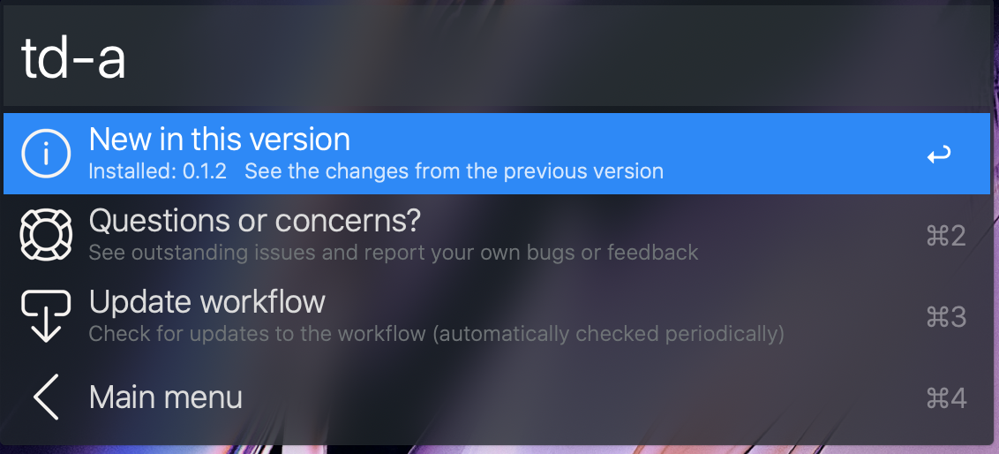

### Experimental updates

Those who want to help test the newest features of the workflow can enable experimental updates in the `td-pref` screen. When enabled, the workflow will prompt you to update to alpha and beta releases for the next major version. Note that these may be unstable and feedback is always appreciated if something goes wrong.

If you are currently using an experimental version the workflow will always prompt you to update to the latest experimental update regardless of this setting. Since fixes are common and often very important during this early stage of development it would not be good to allow old beta versions to continue misbehaving.

Security
--------

Your Microsoft ToDo password is never made available to the workflow or stored in any way. Instead, when you log in through the Microsoft ToDo portal you are asked to authorise the workflow to access your account.

You can log out at any time through the `td-pref` preferences screen. Upon logging out, all caches, synced data, and workflow preferences are removed. To revert to the default workflow settings simply log out then log back in.

Limitations
-----------

* No offline mode – the workflow must be able to connect the the API for each change you make; currently changes made while offline are not saved.
* Languages and date formats – the workflow only officially supports US English at this time. parsedatetime provides US English, UK English, Dutch, German, Portuguese, Russian, and Spanish with varying coverage of keywords (e.g. tomorrow, Tuesday) in each language; your mileage may vary with these languages.

Contributing
------------

So you want to help make this workflow better? That's great! After cloning the repository, run `npm install && grunt` to build the workflow. Open the mstodo-symlinked.alfredworkflow file to install a copy in Alfred that will update whenever you rebuild the workflow. After making a change, simply run `grunt build` to update the workflow then use Alfred to test. Using this process, the workflow is kept up-to-date while you work.

Always run through the tests to ensure that your change does not cause issues elsewhere. When possible, add corresponding tests for your contributions.

Yes, this runs Py2.7. No it won't be updated any time soon, particularly as it relies on Alfred-Workflow which isn't being updated until MacOS ships with Py3 as the default kernel. Complain to Apple if you like, not to me.

Testing
-------

Unit tests are run automatically on every commit to reduce the likelihood of introducing a bug. Nevertheless, your feedback is crucial if anything seems to be broken.

Contributors can use the command `grunt test` to run the test suite and should do so to validate changes in any pull requests. If you add functionality, please back it with unit tests.

Acknowledgements
----------------

This workflow is a fork of the great foundation [Alfred-Wunderlist](http://github.com/idpaterson/alfred-wunderlist-workflow) by [Ian Paterson](https://github.com/idpaterson), which itself relies on the fantastic [Alfred-Workflow](https://github.com/deanishe/alfred-workflow) by [Dean Jackson](https://github.com/deanishe) to communicate with Alfred. The Alfred-Workflow library source code is bundled with the workflow and also included with the repository as a submodule.

Much of the natural language date processing is powered by [parsedatetime](https://github.com/bear/parsedatetime), a tremendously powerful date parser built by [Mike Taylor](https://github.com/bear) and various contributors. [Peewee](https://github.com/coleifer/peewee) by [Charles Leifer](https://github.com/coleifer) provides a simple interface to store and query synced data retrieved from Microsoft ToDo using [Requests](https://github.com/kennethreitz/requests) by [Kenneth Reitz](https://github.com/kennethreitz). The source code of all three libraries is bundled with the workflow and each is included in the repository as a submodule.
